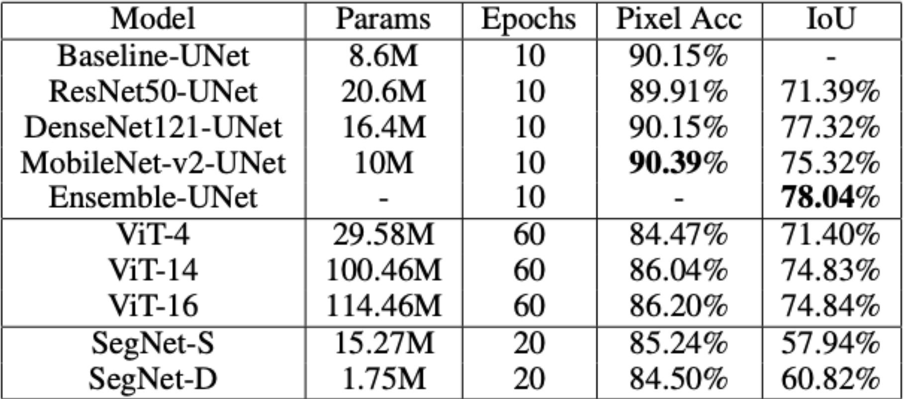

# Deep-Dive-into-Transformer-Segmentation-A-Comparative-Architectural-Study

## Abstract

Image segmentation, a pivotal task in computer vision, facilitates the precise delineation and classification of objects or regions within images. In this comparative study, we investigate the efficacy of trans-former-based models such as ViT (Vision Transformer) and UNet Transformer, alongside the CNN model SegNet, across various architectural configurations for image segmentation tasks. Leveraging the OxfordIIIT pet dataset, we meticulously train and evaluate these models, presenting detailed analyses and performance comparisons. These comparisons clearly indicate the promising nature of Ensembling UNet (with ResNet50, DenseNet121, and MobileNet v2), while ViT-based models perform spectacularly poorly across all given the high number of parameters.

## Methodology

Detailed explanations of each model's architecture and implementation can be found in their respective model folder Readme files. Please refer to the README files in each model folder for comprehensive information on the models used in this study.

## Results 
 

## Refrences

[Our_Paper](Images/DL_Final_Project.pdf)

