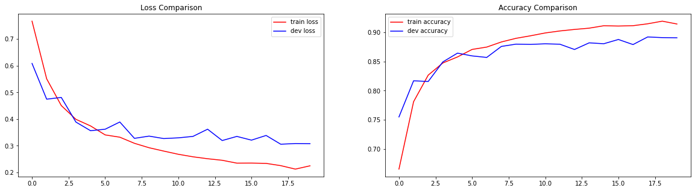
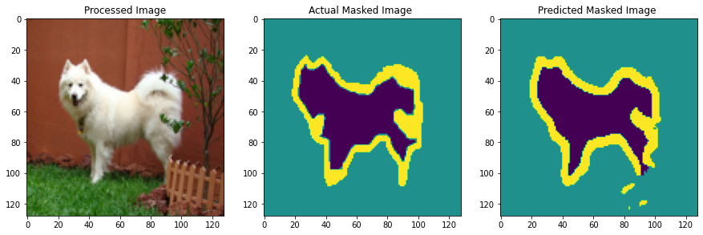

# U-Net Model Overview

The U-Net architecture utilizes an encoder-decoder structure to effectively combine convolutional, max-pooling, and transposed convolutional layers. This structure is designed to capture context, reduce spatial dimensions, and achieve precise localization. The integration of skip connections preserves essential spatial details for accurate segmentation masks.

## Input Specifications

- *Resolution:* Images are resized to 128x128 pixels.
- *Channels:* 3 (RGB).
- *Normalization:* Pixel values normalized to a [0, 1] scale.

## Hyperparameter Tuning

Achieving optimal performance through detailed hyperparameter tuning:

- *Batch Size:* Optimal size determined at 32 (after testing 32, 64, 128).
- *Dropout Rate:* Set at 0.3 to balance regularization with training efficiency, after testing rates between 0.1 and 0.5.
- *Number of Filters:* Begins at 32, doubling in each encoder layer to enhance feature processing capabilities.
- *Epochs:* Limited to 20 to maximize efficiency and prevent overfitting, after testing 20, 50, and 100 epochs.

## Loss and Accuracy Curves for UNet_Baseline

## Results for UNet_Baseline

## UNet-Ensemble Architecture

Integrating three distinct U-Net configurations, each employing a robust backbone for feature extraction:
- *ResNet50 U-Net:* Features ResNet50 layers paired with specialized decoder blocks for refined segmentation.
- *DenseNet121 U-Net:* Utilizes DenseNet121's dense connectivity for improved feature propagation and reuse.
- *MobileNetV2 U-Net:* Optimized for computational efficiency, making it ideal for mobile deployments.

### Loss Functions

Employing a mix of loss functions to finely tune the training process:
- *Sparse Categorical Crossentropy:* Standard baseline for comparison.
- *Dice Loss:* Enhances performance on imbalanced datasets.
- *Categorical Focal Loss:* Concentrates on improving classification of hard examples.
- *Hybrid Losses:* Tailored to specific dataset characteristics, such as focalLoss + 3*diceLoss and (2*focalLoss + 1.7*diceLoss)/2.

### Evaluation Metrics

- *Accuracy*
- *IoU (Intersection over Union)*
- *F-score*
These metrics provide a comprehensive overview of model performance across different thresholds.

## Training and Deployment

The ensemble model is trained with customized data pipelines that include extensive data augmentation and batch processing. This approach ensures the model generalizes well across diverse data distributions. Predictions from each model are weighted based on validation metrics, optimizing the ensemble’s performance.

### Operational Efficiency

With backbones like MobileNetV2, the ensemble not only delivers high accuracy but is also practical for deployment in resource-limited environments.
## Resnet50 Results
(Images/Baseline_Result.png)
## Dense121 Results

## MobileNet Results

## Ensemble Results
