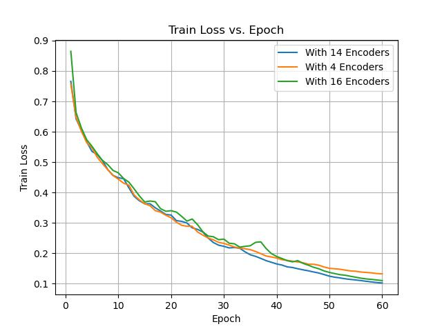
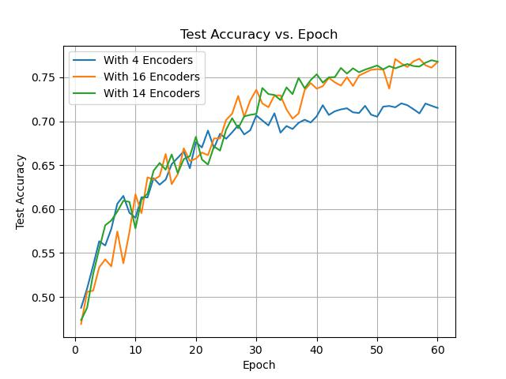
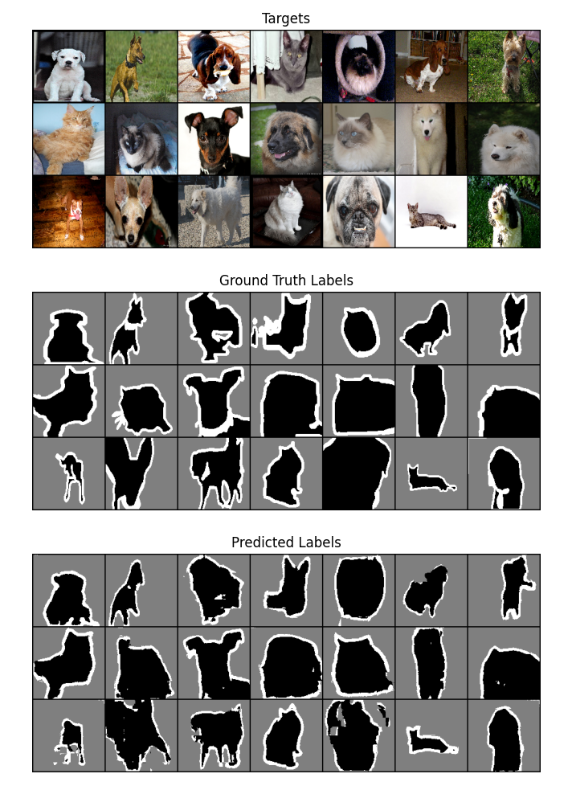
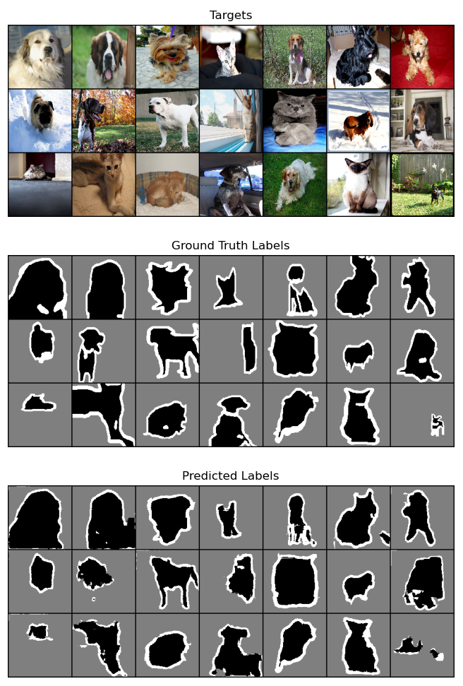
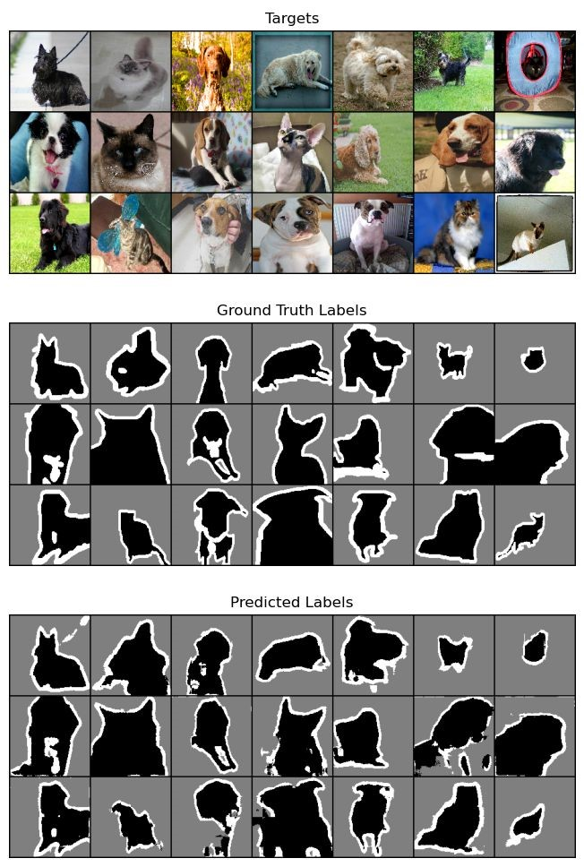

# Vision Transformer for Image Segmentation

This repository contains the implementation of a Vision Transformer-Framework.

## Model Architecture

The model takes as input images with a batch size of 64, 3 channels, and dimensions of 128 x 128 pixels. The input images undergo batch normalization and are divided into patches of 16 x 16 pixels. These patches are transformed into embeddings of dimension 768, incorporating positional information to preserve spatial context. The embeddings are then processed through a series of 14 Transformer Encoder Blocks, each comprising a Self-Attention mechanism and an MLP block. The output of the encoder blocks is amalgamated to generate a mask of the image, serving as the model's output.

## Model Parameters

The total number of parameters of the trained model amounts to 100.46 million.

## Hyperparameter Tuning

Hyperparameter tuning was conducted to optimize model accuracy, encompassing various parameters:

- *Batch Size*: Experimentation with batch sizes of 32, 64, and 128 revealed superior performance with a batch size of 64.
- *Patch Size*: Evaluation of patch sizes 8, 16, and 32 indicated that a patch size of 8 did not generalize well, while a patch size of 32 did not localize effectively. Therefore, a patch size of 16 was deemed optimal.
- *Dropout*: Dropout rates ranging from 0.2 to 0.4 were tested.
- *Self-Attention Head Count*: Different configurations with 8, 12, and 14 self-attention heads were examined.
- *Epochs*: The model underwent training for 20, 50, and 100 epochs, with 50 epochs yielding a balanced performance in terms of training and test accuracy.
- *Embedding Dimension*: We experimented with embedding dimensions of 256, 512, and 768, where the dimension of 768 gave the best result.

## Results

### Train Accuracy

### Test Accuracy 

### Loss Accuracy 

### ViT Encoder with 4 Blocks 

### ViT Encoder with 14 Blocks 

### ViT Encoder with 16 Blocks 

